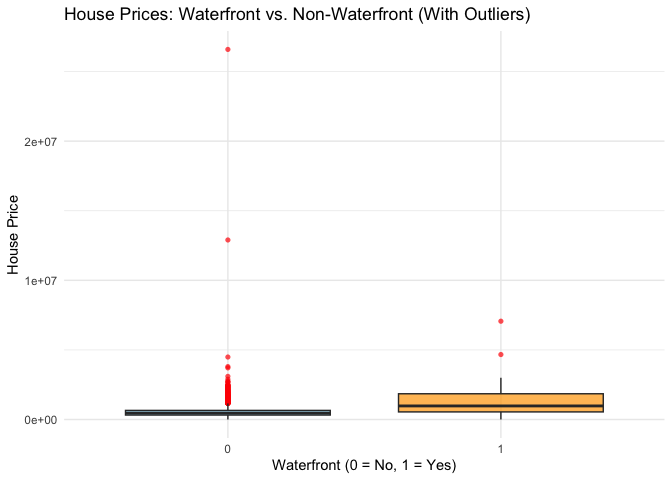
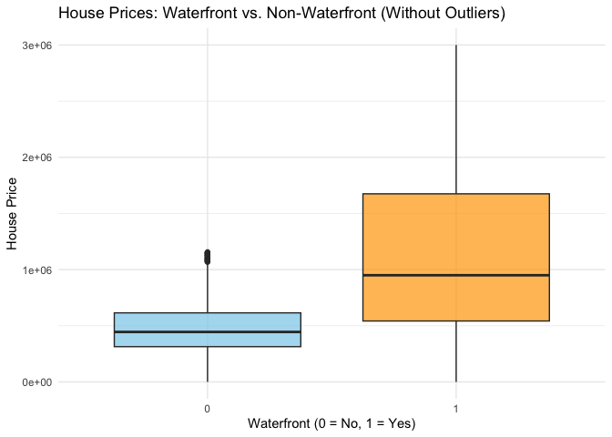

README
================
Lukas DiGiovanni
2025-02-26

## Uploading the Dataset

``` r
# Install required packages if not already installed
if (!require(curl)) install.packages("curl", dependencies = TRUE)
```

    ## Loading required package: curl

    ## Using libcurl 8.11.1 with OpenSSL/3.3.2

``` r
if (!require(utils)) install.packages("utils", dependencies = TRUE)

# Load the packages
library(curl)
library(utils)

# Define the URL from Kaggle
dataset_url <- "https://www.kaggle.com/api/v1/datasets/download/fratzcan/usa-house-prices"

# Set the output file paths
zip_file <- "./usa-house-prices.zip"
extract_dir <- "./usa-house-prices"

# Download the ZIP file
curl_download(dataset_url, zip_file)

# Create extraction directory if it doesn't exist
if (!dir.exists(extract_dir)) dir.create(extract_dir)

# Unzip the file
unzip(zip_file, exdir = extract_dir)

# List extracted files
extracted_files <- list.files(extract_dir, full.names = TRUE)
message("Download and extraction complete! Files saved at: ", extract_dir)
```

    ## Download and extraction complete! Files saved at: ./usa-house-prices

``` r
message("Extracted files: ", paste(extracted_files, collapse = ", "))
```

    ## Extracted files: ./usa-house-prices/USA Housing Dataset.csv

``` r
setwd("/Users/lukasdigiovanni/Desktop/DS_201")

data <- read.csv("USA Housing Dataset.csv")
```

## Dataset Review

This code is used to find the date range of the dataset.

``` r
#Code to find the earliest and latest dates
data[["date"]] <- as.Date(data[["date"]])

# Find the earliest and latest dates
earliest_date <- min(data[["date"]], na.rm = TRUE)
latest_date <- max(data[["date"]], na.rm = TRUE)

# Print results
print(earliest_date)
```

    ## [1] "2014-05-02"

``` r
print(latest_date)
```

    ## [1] "2014-07-10"

**When was the data collected?** The data was collected in 2014. The
time range is from 5/2/2014 to 7/10/2014. The data was uploaded to
kaggle and last updated seven months ago.

**Where was the data acquired?** The data was acquired from kaggle.com.
The data found on that website was originally on zillow.com, the real
estate website.

**How was the data acquired?** Zillow’s Economic Research Team gathers,
refines, and publishes housing and economic data from both public and
proprietary sources. The core of Zillow’s data is derived from public
property records filed with local municipalities, including deeds,
property details, parcel information, and transaction histories. Many of
the statistics in these datasets are calculated from raw property data.
The methodology behind these calculations is further explained in the
next section, where the dataset attributes are described.

**What are the attributes of this dataset?** The dataset consists of 18
attributes that describe various characteristics of properties. The
Price variable represents the sale price of the property in USD and
serves as the target variable. Property features such as Bedrooms,
Bathrooms, Sqft Living, Sqft Lot, and Floors provide insight into the
size and layout of the home. The View and Condition variables are
ordinal indices that rate the property’s visual appeal and overall
state. The Waterfront attribute is a nominal, binary indicator of
whether the property has a waterfront view. Additionally, the dataset
includes Yr Built and Yr Renovated, which record the year the property
was originally constructed and last updated. Location-based attributes,
including Street, City, Statezip, and Country, offer contextual
information on where the property is situated.

**What type of data do these attributes contain?** The dataset contains
a mix of nominal, ordinal, interval, and ratio data types. Nominal
variables include categorical data without an inherent order, such as
Street, City, Statezip, Country, and Waterfront. Ordinal variables
represent ranked attributes with meaningful order but uneven intervals,
such as View, Condition, and Date. Interval data, such as Yr Built and
Yr Renovated, have meaningful differences between values but no true
zero point. Finally, Ratio data includes numerical attributes with a
true zero, such as Price, Bedrooms, Bathrooms, Sqft Living, Sqft Lot,
Floors, Sqft Above, and Sqft Basement, allowing for meaningful
comparisons and calculations.

## Data Dictionary

This code creates a table that shows the meaning of each variable
included in the dataset.

``` r
#import data dictionary
data_dictionary = read.csv("data_dictionary.csv")

library(knitr)
library(kableExtra)

# Create a nice table with kable and kableExtra
kable(data_dictionary, caption = "Variable Descriptions", col.names = c("Variable", "Description", "Type")) %>%
  kable_styling(bootstrap_options = c("striped", "hover", "condensed"), full_width = FALSE) %>%
  column_spec(1, bold = TRUE) %>%
  column_spec(2, italic = TRUE) %>%
  row_spec(0, background = "lightgray")  # Add a gray background to the header
```
<table class="table table-striped table-hover table-condensed" style="width: auto !important; margin-left: auto; margin-right: auto;">
<caption>
Variable Descriptions
</caption>
<thead>
<tr>
<th style="text-align:left;background-color: lightgray !important;">
Variable
</th>
<th style="text-align:left;background-color: lightgray !important;">
Description
</th>
<th style="text-align:left;background-color: lightgray !important;">
Type
</th>
</tr>
</thead>
<tbody>
<tr>
<td style="text-align:left;font-weight: bold;">
Date
</td>
<td style="text-align:left;font-style: italic;">
The date when the property was sold. This feature helps in understanding
the temporal trends in property prices.
</td>
<td style="text-align:left;">
Ordinal
</td>
</tr>
<tr>
<td style="text-align:left;font-weight: bold;">
Price
</td>
<td style="text-align:left;font-style: italic;">
The sale price of the property in USD. This is the target variable we
aim to predict.
</td>
<td style="text-align:left;">
Ratio
</td>
</tr>
<tr>
<td style="text-align:left;font-weight: bold;">
Bedrooms
</td>
<td style="text-align:left;font-style: italic;">
The number of bedrooms in the property. Generally, properties withmore
bedrooms tend to have higher prices.
</td>
<td style="text-align:left;">
Ratio
</td>
</tr>
<tr>
<td style="text-align:left;font-weight: bold;">
Bathrooms
</td>
<td style="text-align:left;font-style: italic;">
The number of bathrooms in the property. Similar to bedrooms, more
bathrooms can increase a property’s value.
</td>
<td style="text-align:left;">
Ratio
</td>
</tr>
<tr>
<td style="text-align:left;font-weight: bold;">
Sqft Living
</td>
<td style="text-align:left;font-style: italic;">
The size of the living area in square feet. Larger living areas are
typically associated with higher property values.
</td>
<td style="text-align:left;">
Ratio
</td>
</tr>
<tr>
<td style="text-align:left;font-weight: bold;">
Sqft Lot
</td>
<td style="text-align:left;font-style: italic;">
The size of the lot in square feet. Larger lots may increase a
property’s desirability and value.
</td>
<td style="text-align:left;">
Ratio
</td>
</tr>
<tr>
<td style="text-align:left;font-weight: bold;">
Floors
</td>
<td style="text-align:left;font-style: italic;">
The number of floors in the property. Properties with multiple floors
may offer more living space and appeal.
</td>
<td style="text-align:left;">
Ratio
</td>
</tr>
<tr>
<td style="text-align:left;font-weight: bold;">
Waterfront
</td>
<td style="text-align:left;font-style: italic;">
A binary indicator (1 if the property has a waterfront view, 0
other-wise). Properties with waterfront views are often valued higher.
</td>
<td style="text-align:left;">
Nominal
</td>
</tr>
<tr>
<td style="text-align:left;font-weight: bold;">
View
</td>
<td style="text-align:left;font-style: italic;">
An index from 0 to 4 indicating the quality of the property’s view.
Better views are likely to enhance a property’s value.
</td>
<td style="text-align:left;">
Ordinal
</td>
</tr>
<tr>
<td style="text-align:left;font-weight: bold;">
Condition
</td>
<td style="text-align:left;font-style: italic;">
An index from 1 to 5 rating the condition of the property. Properties in
better condition are typically worth more.
</td>
<td style="text-align:left;">
Ordinal
</td>
</tr>
<tr>
<td style="text-align:left;font-weight: bold;">
Sqft Above
</td>
<td style="text-align:left;font-style: italic;">
The square footage of the property above the basement. This can help
isolate the value contribution of above-ground space.
</td>
<td style="text-align:left;">
Ratio
</td>
</tr>
<tr>
<td style="text-align:left;font-weight: bold;">
Sqft Basement
</td>
<td style="text-align:left;font-style: italic;">
The square footage of the basement. Basements may add value depending on
their usability.
</td>
<td style="text-align:left;">
Ratio
</td>
</tr>
<tr>
<td style="text-align:left;font-weight: bold;">
Yr Built
</td>
<td style="text-align:left;font-style: italic;">
The year the property was built. Older properties may have historical
value, while newer ones may offer modern amenities.
</td>
<td style="text-align:left;">
Interval
</td>
</tr>
<tr>
<td style="text-align:left;font-weight: bold;">
Yr Renovated
</td>
<td style="text-align:left;font-style: italic;">
The year the property was last renovated. Recent renovations can
increase a property’s appeal and value.
</td>
<td style="text-align:left;">
Interval
</td>
</tr>
<tr>
<td style="text-align:left;font-weight: bold;">
Street
</td>
<td style="text-align:left;font-style: italic;">
The street address of the property. This feature can be used to analyze
location-specific price trends.
</td>
<td style="text-align:left;">
Nominal
</td>
</tr>
<tr>
<td style="text-align:left;font-weight: bold;">
City
</td>
<td style="text-align:left;font-style: italic;">
he city where the property is located. Different cities have distinct
market dynamics.
</td>
<td style="text-align:left;">
Nominal
</td>
</tr>
<tr>
<td style="text-align:left;font-weight: bold;">
Statezip
</td>
<td style="text-align:left;font-style: italic;">
The state and zip code of the property. This feature provides regional
context for the property.
</td>
<td style="text-align:left;">
Nominal
</td>
</tr>
<tr>
<td style="text-align:left;font-weight: bold;">
Country
</td>
<td style="text-align:left;font-style: italic;">
The country where the property is located. While this dataset focuses on
properties in Australia, this feature is included for completeness.
</td>
<td style="text-align:left;">
Nominal
</td>
</tr>
</tbody>
</table>

## Summary of Statistics

This code creates a summary of the variables, including count, mean,
standard deviation, min, Q1, Median, Q3, and max.

``` r
# Load necessary libraries
library(dplyr)
```

    ## 
    ## Attaching package: 'dplyr'

    ## The following object is masked from 'package:kableExtra':
    ## 
    ##     group_rows

    ## The following objects are masked from 'package:stats':
    ## 
    ##     filter, lag

    ## The following objects are masked from 'package:base':
    ## 
    ##     intersect, setdiff, setequal, union

``` r
library(readr)
```

    ## 
    ## Attaching package: 'readr'

    ## The following object is masked from 'package:curl':
    ## 
    ##     parse_date

``` r
library(gt)
library(tidyr)  # Needed for pivoting data

# Select numeric columns
numeric_data <- data %>%
  select(where(is.numeric))

# Generate summary statistics using reframe() to avoid errors
numeric_summary <- numeric_data %>%
  reframe(
    Variable = names(.),
    Count = sapply(., function(x) sum(!is.na(x))),
    Mean = sapply(., mean, na.rm = TRUE),
    SD = sapply(., sd, na.rm = TRUE),
    Min = sapply(., min, na.rm = TRUE),
    Q1 = sapply(., quantile, 0.25, na.rm = TRUE),
    Median = sapply(., median, na.rm = TRUE),
    Q3 = sapply(., quantile, 0.75, na.rm = TRUE),
    Max = sapply(., max, na.rm = TRUE)
  )

# Create a nicely formatted table with gt
numeric_summary %>%
  gt() %>%
  tab_header(title = "Summary Statistics - Numeric Variables") %>%
  fmt_number(columns = -1, decimals = 2) %>%
  tab_options(
    table.border.top.color = "black",
    table.border.bottom.color = "black",
    row.striping.include_table_body = TRUE
  )
```

<div id="dxmgjsmicy" style="padding-left:0px;padding-right:0px;padding-top:10px;padding-bottom:10px;overflow-x:auto;overflow-y:auto;width:auto;height:auto;">
<style>#dxmgjsmicy table {
  font-family: system-ui, 'Segoe UI', Roboto, Helvetica, Arial, sans-serif, 'Apple Color Emoji', 'Segoe UI Emoji', 'Segoe UI Symbol', 'Noto Color Emoji';
  -webkit-font-smoothing: antialiased;
  -moz-osx-font-smoothing: grayscale;
}
&#10;#dxmgjsmicy thead, #dxmgjsmicy tbody, #dxmgjsmicy tfoot, #dxmgjsmicy tr, #dxmgjsmicy td, #dxmgjsmicy th {
  border-style: none;
}
&#10;#dxmgjsmicy p {
  margin: 0;
  padding: 0;
}
&#10;#dxmgjsmicy .gt_table {
  display: table;
  border-collapse: collapse;
  line-height: normal;
  margin-left: auto;
  margin-right: auto;
  color: #333333;
  font-size: 16px;
  font-weight: normal;
  font-style: normal;
  background-color: #FFFFFF;
  width: auto;
  border-top-style: solid;
  border-top-width: 2px;
  border-top-color: #000000;
  border-right-style: none;
  border-right-width: 2px;
  border-right-color: #D3D3D3;
  border-bottom-style: solid;
  border-bottom-width: 2px;
  border-bottom-color: #000000;
  border-left-style: none;
  border-left-width: 2px;
  border-left-color: #D3D3D3;
}
&#10;#dxmgjsmicy .gt_caption {
  padding-top: 4px;
  padding-bottom: 4px;
}
&#10;#dxmgjsmicy .gt_title {
  color: #333333;
  font-size: 125%;
  font-weight: initial;
  padding-top: 4px;
  padding-bottom: 4px;
  padding-left: 5px;
  padding-right: 5px;
  border-bottom-color: #FFFFFF;
  border-bottom-width: 0;
}
&#10;#dxmgjsmicy .gt_subtitle {
  color: #333333;
  font-size: 85%;
  font-weight: initial;
  padding-top: 3px;
  padding-bottom: 5px;
  padding-left: 5px;
  padding-right: 5px;
  border-top-color: #FFFFFF;
  border-top-width: 0;
}
&#10;#dxmgjsmicy .gt_heading {
  background-color: #FFFFFF;
  text-align: center;
  border-bottom-color: #FFFFFF;
  border-left-style: none;
  border-left-width: 1px;
  border-left-color: #D3D3D3;
  border-right-style: none;
  border-right-width: 1px;
  border-right-color: #D3D3D3;
}
&#10;#dxmgjsmicy .gt_bottom_border {
  border-bottom-style: solid;
  border-bottom-width: 2px;
  border-bottom-color: #D3D3D3;
}
&#10;#dxmgjsmicy .gt_col_headings {
  border-top-style: solid;
  border-top-width: 2px;
  border-top-color: #D3D3D3;
  border-bottom-style: solid;
  border-bottom-width: 2px;
  border-bottom-color: #D3D3D3;
  border-left-style: none;
  border-left-width: 1px;
  border-left-color: #D3D3D3;
  border-right-style: none;
  border-right-width: 1px;
  border-right-color: #D3D3D3;
}
&#10;#dxmgjsmicy .gt_col_heading {
  color: #333333;
  background-color: #FFFFFF;
  font-size: 100%;
  font-weight: normal;
  text-transform: inherit;
  border-left-style: none;
  border-left-width: 1px;
  border-left-color: #D3D3D3;
  border-right-style: none;
  border-right-width: 1px;
  border-right-color: #D3D3D3;
  vertical-align: bottom;
  padding-top: 5px;
  padding-bottom: 6px;
  padding-left: 5px;
  padding-right: 5px;
  overflow-x: hidden;
}
&#10;#dxmgjsmicy .gt_column_spanner_outer {
  color: #333333;
  background-color: #FFFFFF;
  font-size: 100%;
  font-weight: normal;
  text-transform: inherit;
  padding-top: 0;
  padding-bottom: 0;
  padding-left: 4px;
  padding-right: 4px;
}
&#10;#dxmgjsmicy .gt_column_spanner_outer:first-child {
  padding-left: 0;
}
&#10;#dxmgjsmicy .gt_column_spanner_outer:last-child {
  padding-right: 0;
}
&#10;#dxmgjsmicy .gt_column_spanner {
  border-bottom-style: solid;
  border-bottom-width: 2px;
  border-bottom-color: #D3D3D3;
  vertical-align: bottom;
  padding-top: 5px;
  padding-bottom: 5px;
  overflow-x: hidden;
  display: inline-block;
  width: 100%;
}
&#10;#dxmgjsmicy .gt_spanner_row {
  border-bottom-style: hidden;
}
&#10;#dxmgjsmicy .gt_group_heading {
  padding-top: 8px;
  padding-bottom: 8px;
  padding-left: 5px;
  padding-right: 5px;
  color: #333333;
  background-color: #FFFFFF;
  font-size: 100%;
  font-weight: initial;
  text-transform: inherit;
  border-top-style: solid;
  border-top-width: 2px;
  border-top-color: #D3D3D3;
  border-bottom-style: solid;
  border-bottom-width: 2px;
  border-bottom-color: #D3D3D3;
  border-left-style: none;
  border-left-width: 1px;
  border-left-color: #D3D3D3;
  border-right-style: none;
  border-right-width: 1px;
  border-right-color: #D3D3D3;
  vertical-align: middle;
  text-align: left;
}
&#10;#dxmgjsmicy .gt_empty_group_heading {
  padding: 0.5px;
  color: #333333;
  background-color: #FFFFFF;
  font-size: 100%;
  font-weight: initial;
  border-top-style: solid;
  border-top-width: 2px;
  border-top-color: #D3D3D3;
  border-bottom-style: solid;
  border-bottom-width: 2px;
  border-bottom-color: #D3D3D3;
  vertical-align: middle;
}
&#10;#dxmgjsmicy .gt_from_md > :first-child {
  margin-top: 0;
}
&#10;#dxmgjsmicy .gt_from_md > :last-child {
  margin-bottom: 0;
}
&#10;#dxmgjsmicy .gt_row {
  padding-top: 8px;
  padding-bottom: 8px;
  padding-left: 5px;
  padding-right: 5px;
  margin: 10px;
  border-top-style: solid;
  border-top-width: 1px;
  border-top-color: #D3D3D3;
  border-left-style: none;
  border-left-width: 1px;
  border-left-color: #D3D3D3;
  border-right-style: none;
  border-right-width: 1px;
  border-right-color: #D3D3D3;
  vertical-align: middle;
  overflow-x: hidden;
}
&#10;#dxmgjsmicy .gt_stub {
  color: #333333;
  background-color: #FFFFFF;
  font-size: 100%;
  font-weight: initial;
  text-transform: inherit;
  border-right-style: solid;
  border-right-width: 2px;
  border-right-color: #D3D3D3;
  padding-left: 5px;
  padding-right: 5px;
}
&#10;#dxmgjsmicy .gt_stub_row_group {
  color: #333333;
  background-color: #FFFFFF;
  font-size: 100%;
  font-weight: initial;
  text-transform: inherit;
  border-right-style: solid;
  border-right-width: 2px;
  border-right-color: #D3D3D3;
  padding-left: 5px;
  padding-right: 5px;
  vertical-align: top;
}
&#10;#dxmgjsmicy .gt_row_group_first td {
  border-top-width: 2px;
}
&#10;#dxmgjsmicy .gt_row_group_first th {
  border-top-width: 2px;
}
&#10;#dxmgjsmicy .gt_summary_row {
  color: #333333;
  background-color: #FFFFFF;
  text-transform: inherit;
  padding-top: 8px;
  padding-bottom: 8px;
  padding-left: 5px;
  padding-right: 5px;
}
&#10;#dxmgjsmicy .gt_first_summary_row {
  border-top-style: solid;
  border-top-color: #D3D3D3;
}
&#10;#dxmgjsmicy .gt_first_summary_row.thick {
  border-top-width: 2px;
}
&#10;#dxmgjsmicy .gt_last_summary_row {
  padding-top: 8px;
  padding-bottom: 8px;
  padding-left: 5px;
  padding-right: 5px;
  border-bottom-style: solid;
  border-bottom-width: 2px;
  border-bottom-color: #D3D3D3;
}
&#10;#dxmgjsmicy .gt_grand_summary_row {
  color: #333333;
  background-color: #FFFFFF;
  text-transform: inherit;
  padding-top: 8px;
  padding-bottom: 8px;
  padding-left: 5px;
  padding-right: 5px;
}
&#10;#dxmgjsmicy .gt_first_grand_summary_row {
  padding-top: 8px;
  padding-bottom: 8px;
  padding-left: 5px;
  padding-right: 5px;
  border-top-style: double;
  border-top-width: 6px;
  border-top-color: #D3D3D3;
}
&#10;#dxmgjsmicy .gt_last_grand_summary_row_top {
  padding-top: 8px;
  padding-bottom: 8px;
  padding-left: 5px;
  padding-right: 5px;
  border-bottom-style: double;
  border-bottom-width: 6px;
  border-bottom-color: #D3D3D3;
}
&#10;#dxmgjsmicy .gt_striped {
  background-color: rgba(128, 128, 128, 0.05);
}
&#10;#dxmgjsmicy .gt_table_body {
  border-top-style: solid;
  border-top-width: 2px;
  border-top-color: #D3D3D3;
  border-bottom-style: solid;
  border-bottom-width: 2px;
  border-bottom-color: #D3D3D3;
}
&#10;#dxmgjsmicy .gt_footnotes {
  color: #333333;
  background-color: #FFFFFF;
  border-bottom-style: none;
  border-bottom-width: 2px;
  border-bottom-color: #D3D3D3;
  border-left-style: none;
  border-left-width: 2px;
  border-left-color: #D3D3D3;
  border-right-style: none;
  border-right-width: 2px;
  border-right-color: #D3D3D3;
}
&#10;#dxmgjsmicy .gt_footnote {
  margin: 0px;
  font-size: 90%;
  padding-top: 4px;
  padding-bottom: 4px;
  padding-left: 5px;
  padding-right: 5px;
}
&#10;#dxmgjsmicy .gt_sourcenotes {
  color: #333333;
  background-color: #FFFFFF;
  border-bottom-style: none;
  border-bottom-width: 2px;
  border-bottom-color: #D3D3D3;
  border-left-style: none;
  border-left-width: 2px;
  border-left-color: #D3D3D3;
  border-right-style: none;
  border-right-width: 2px;
  border-right-color: #D3D3D3;
}
&#10;#dxmgjsmicy .gt_sourcenote {
  font-size: 90%;
  padding-top: 4px;
  padding-bottom: 4px;
  padding-left: 5px;
  padding-right: 5px;
}
&#10;#dxmgjsmicy .gt_left {
  text-align: left;
}
&#10;#dxmgjsmicy .gt_center {
  text-align: center;
}
&#10;#dxmgjsmicy .gt_right {
  text-align: right;
  font-variant-numeric: tabular-nums;
}
&#10;#dxmgjsmicy .gt_font_normal {
  font-weight: normal;
}
&#10;#dxmgjsmicy .gt_font_bold {
  font-weight: bold;
}
&#10;#dxmgjsmicy .gt_font_italic {
  font-style: italic;
}
&#10;#dxmgjsmicy .gt_super {
  font-size: 65%;
}
&#10;#dxmgjsmicy .gt_footnote_marks {
  font-size: 75%;
  vertical-align: 0.4em;
  position: initial;
}
&#10;#dxmgjsmicy .gt_asterisk {
  font-size: 100%;
  vertical-align: 0;
}
&#10;#dxmgjsmicy .gt_indent_1 {
  text-indent: 5px;
}
&#10;#dxmgjsmicy .gt_indent_2 {
  text-indent: 10px;
}
&#10;#dxmgjsmicy .gt_indent_3 {
  text-indent: 15px;
}
&#10;#dxmgjsmicy .gt_indent_4 {
  text-indent: 20px;
}
&#10;#dxmgjsmicy .gt_indent_5 {
  text-indent: 25px;
}
&#10;#dxmgjsmicy .katex-display {
  display: inline-flex !important;
  margin-bottom: 0.75em !important;
}
&#10;#dxmgjsmicy div.Reactable > div.rt-table > div.rt-thead > div.rt-tr.rt-tr-group-header > div.rt-th-group:after {
  height: 0px !important;
}
</style>
<table class="gt_table" data-quarto-disable-processing="false" data-quarto-bootstrap="false">
  <thead>
    <tr class="gt_heading">
      <td colspan="9" class="gt_heading gt_title gt_font_normal gt_bottom_border" style>Summary Statistics - Numeric Variables</td>
    </tr>
    &#10;    <tr class="gt_col_headings">
      <th class="gt_col_heading gt_columns_bottom_border gt_left" rowspan="1" colspan="1" scope="col" id="Variable">Variable</th>
      <th class="gt_col_heading gt_columns_bottom_border gt_right" rowspan="1" colspan="1" scope="col" id="Count">Count</th>
      <th class="gt_col_heading gt_columns_bottom_border gt_right" rowspan="1" colspan="1" scope="col" id="Mean">Mean</th>
      <th class="gt_col_heading gt_columns_bottom_border gt_right" rowspan="1" colspan="1" scope="col" id="SD">SD</th>
      <th class="gt_col_heading gt_columns_bottom_border gt_right" rowspan="1" colspan="1" scope="col" id="Min">Min</th>
      <th class="gt_col_heading gt_columns_bottom_border gt_right" rowspan="1" colspan="1" scope="col" id="Q1">Q1</th>
      <th class="gt_col_heading gt_columns_bottom_border gt_right" rowspan="1" colspan="1" scope="col" id="Median">Median</th>
      <th class="gt_col_heading gt_columns_bottom_border gt_right" rowspan="1" colspan="1" scope="col" id="Q3">Q3</th>
      <th class="gt_col_heading gt_columns_bottom_border gt_right" rowspan="1" colspan="1" scope="col" id="Max">Max</th>
    </tr>
  </thead>
  <tbody class="gt_table_body">
    <tr><td headers="Variable" class="gt_row gt_left">price</td>
<td headers="Count" class="gt_row gt_right">4,140.00</td>
<td headers="Mean" class="gt_row gt_right">553,062.88</td>
<td headers="SD" class="gt_row gt_right">583,686.45</td>
<td headers="Min" class="gt_row gt_right">0.00</td>
<td headers="Q1" class="gt_row gt_right">320,000.00</td>
<td headers="Median" class="gt_row gt_right">460,000.00</td>
<td headers="Q3" class="gt_row gt_right">659,125.00</td>
<td headers="Max" class="gt_row gt_right">26,590,000.00</td></tr>
    <tr><td headers="Variable" class="gt_row gt_left gt_striped">bedrooms</td>
<td headers="Count" class="gt_row gt_right gt_striped">4,140.00</td>
<td headers="Mean" class="gt_row gt_right gt_striped">3.40</td>
<td headers="SD" class="gt_row gt_right gt_striped">0.90</td>
<td headers="Min" class="gt_row gt_right gt_striped">0.00</td>
<td headers="Q1" class="gt_row gt_right gt_striped">3.00</td>
<td headers="Median" class="gt_row gt_right gt_striped">3.00</td>
<td headers="Q3" class="gt_row gt_right gt_striped">4.00</td>
<td headers="Max" class="gt_row gt_right gt_striped">8.00</td></tr>
    <tr><td headers="Variable" class="gt_row gt_left">bathrooms</td>
<td headers="Count" class="gt_row gt_right">4,140.00</td>
<td headers="Mean" class="gt_row gt_right">2.16</td>
<td headers="SD" class="gt_row gt_right">0.78</td>
<td headers="Min" class="gt_row gt_right">0.00</td>
<td headers="Q1" class="gt_row gt_right">1.75</td>
<td headers="Median" class="gt_row gt_right">2.25</td>
<td headers="Q3" class="gt_row gt_right">2.50</td>
<td headers="Max" class="gt_row gt_right">6.75</td></tr>
    <tr><td headers="Variable" class="gt_row gt_left gt_striped">sqft_living</td>
<td headers="Count" class="gt_row gt_right gt_striped">4,140.00</td>
<td headers="Mean" class="gt_row gt_right gt_striped">2,143.64</td>
<td headers="SD" class="gt_row gt_right gt_striped">957.48</td>
<td headers="Min" class="gt_row gt_right gt_striped">370.00</td>
<td headers="Q1" class="gt_row gt_right gt_striped">1,470.00</td>
<td headers="Median" class="gt_row gt_right gt_striped">1,980.00</td>
<td headers="Q3" class="gt_row gt_right gt_striped">2,620.00</td>
<td headers="Max" class="gt_row gt_right gt_striped">10,040.00</td></tr>
    <tr><td headers="Variable" class="gt_row gt_left">sqft_lot</td>
<td headers="Count" class="gt_row gt_right">4,140.00</td>
<td headers="Mean" class="gt_row gt_right">14,697.64</td>
<td headers="SD" class="gt_row gt_right">35,876.84</td>
<td headers="Min" class="gt_row gt_right">638.00</td>
<td headers="Q1" class="gt_row gt_right">5,000.00</td>
<td headers="Median" class="gt_row gt_right">7,676.00</td>
<td headers="Q3" class="gt_row gt_right">11,000.00</td>
<td headers="Max" class="gt_row gt_right">1,074,218.00</td></tr>
    <tr><td headers="Variable" class="gt_row gt_left gt_striped">floors</td>
<td headers="Count" class="gt_row gt_right gt_striped">4,140.00</td>
<td headers="Mean" class="gt_row gt_right gt_striped">1.51</td>
<td headers="SD" class="gt_row gt_right gt_striped">0.53</td>
<td headers="Min" class="gt_row gt_right gt_striped">1.00</td>
<td headers="Q1" class="gt_row gt_right gt_striped">1.00</td>
<td headers="Median" class="gt_row gt_right gt_striped">1.50</td>
<td headers="Q3" class="gt_row gt_right gt_striped">2.00</td>
<td headers="Max" class="gt_row gt_right gt_striped">3.50</td></tr>
    <tr><td headers="Variable" class="gt_row gt_left">waterfront</td>
<td headers="Count" class="gt_row gt_right">4,140.00</td>
<td headers="Mean" class="gt_row gt_right">0.01</td>
<td headers="SD" class="gt_row gt_right">0.09</td>
<td headers="Min" class="gt_row gt_right">0.00</td>
<td headers="Q1" class="gt_row gt_right">0.00</td>
<td headers="Median" class="gt_row gt_right">0.00</td>
<td headers="Q3" class="gt_row gt_right">0.00</td>
<td headers="Max" class="gt_row gt_right">1.00</td></tr>
    <tr><td headers="Variable" class="gt_row gt_left gt_striped">view</td>
<td headers="Count" class="gt_row gt_right gt_striped">4,140.00</td>
<td headers="Mean" class="gt_row gt_right gt_striped">0.25</td>
<td headers="SD" class="gt_row gt_right gt_striped">0.79</td>
<td headers="Min" class="gt_row gt_right gt_striped">0.00</td>
<td headers="Q1" class="gt_row gt_right gt_striped">0.00</td>
<td headers="Median" class="gt_row gt_right gt_striped">0.00</td>
<td headers="Q3" class="gt_row gt_right gt_striped">0.00</td>
<td headers="Max" class="gt_row gt_right gt_striped">4.00</td></tr>
    <tr><td headers="Variable" class="gt_row gt_left">condition</td>
<td headers="Count" class="gt_row gt_right">4,140.00</td>
<td headers="Mean" class="gt_row gt_right">3.45</td>
<td headers="SD" class="gt_row gt_right">0.68</td>
<td headers="Min" class="gt_row gt_right">1.00</td>
<td headers="Q1" class="gt_row gt_right">3.00</td>
<td headers="Median" class="gt_row gt_right">3.00</td>
<td headers="Q3" class="gt_row gt_right">4.00</td>
<td headers="Max" class="gt_row gt_right">5.00</td></tr>
    <tr><td headers="Variable" class="gt_row gt_left gt_striped">sqft_above</td>
<td headers="Count" class="gt_row gt_right gt_striped">4,140.00</td>
<td headers="Mean" class="gt_row gt_right gt_striped">1,831.35</td>
<td headers="SD" class="gt_row gt_right gt_striped">861.38</td>
<td headers="Min" class="gt_row gt_right gt_striped">370.00</td>
<td headers="Q1" class="gt_row gt_right gt_striped">1,190.00</td>
<td headers="Median" class="gt_row gt_right gt_striped">1,600.00</td>
<td headers="Q3" class="gt_row gt_right gt_striped">2,310.00</td>
<td headers="Max" class="gt_row gt_right gt_striped">8,020.00</td></tr>
    <tr><td headers="Variable" class="gt_row gt_left">sqft_basement</td>
<td headers="Count" class="gt_row gt_right">4,140.00</td>
<td headers="Mean" class="gt_row gt_right">312.29</td>
<td headers="SD" class="gt_row gt_right">464.35</td>
<td headers="Min" class="gt_row gt_right">0.00</td>
<td headers="Q1" class="gt_row gt_right">0.00</td>
<td headers="Median" class="gt_row gt_right">0.00</td>
<td headers="Q3" class="gt_row gt_right">602.50</td>
<td headers="Max" class="gt_row gt_right">4,820.00</td></tr>
    <tr><td headers="Variable" class="gt_row gt_left gt_striped">yr_built</td>
<td headers="Count" class="gt_row gt_right gt_striped">4,140.00</td>
<td headers="Mean" class="gt_row gt_right gt_striped">1,970.81</td>
<td headers="SD" class="gt_row gt_right gt_striped">29.81</td>
<td headers="Min" class="gt_row gt_right gt_striped">1,900.00</td>
<td headers="Q1" class="gt_row gt_right gt_striped">1,951.00</td>
<td headers="Median" class="gt_row gt_right gt_striped">1,976.00</td>
<td headers="Q3" class="gt_row gt_right gt_striped">1,997.00</td>
<td headers="Max" class="gt_row gt_right gt_striped">2,014.00</td></tr>
    <tr><td headers="Variable" class="gt_row gt_left">yr_renovated</td>
<td headers="Count" class="gt_row gt_right">4,140.00</td>
<td headers="Mean" class="gt_row gt_right">808.37</td>
<td headers="SD" class="gt_row gt_right">979.38</td>
<td headers="Min" class="gt_row gt_right">0.00</td>
<td headers="Q1" class="gt_row gt_right">0.00</td>
<td headers="Median" class="gt_row gt_right">0.00</td>
<td headers="Q3" class="gt_row gt_right">1,999.00</td>
<td headers="Max" class="gt_row gt_right">2,014.00</td></tr>
  </tbody>
  &#10;  
</table>
</div>

# Updated Summary Statistics

This code updates the summary statistics with the mode and any missing
data.

``` r
# Load necessary libraries (some already loaded earlier, added here for completeness)
library(dplyr)
library(readr)
library(kableExtra)

# Function to calculate mode
calculate_mode <- function(x) {
  unique_x <- na.omit(x)
  if (length(unique_x) == 0) return(NA)
  mode_value <- unique_x[which.max(tabulate(match(x, unique_x)))]
  return(mode_value)
}

# Use the existing 'data' dataframe loaded from "USA Housing Dataset.csv"
df <- data

# Select numeric columns
numeric_df <- df %>%
  select(where(is.numeric))

# Select nominal (categorical) columns
# Note: Assuming 'street', 'city', 'statezip', 'country' are character columns as per dataset description
nominal_df <- df %>%
  select(where(is.character))

# Generate summary statistics for numeric variables
numeric_summary <- numeric_df %>%
  reframe(
    Variable = names(.),
    Count = sapply(., function(x) sum(!is.na(x))),
    Missing = sapply(., function(x) sum(is.na(x))),
    Mean = sapply(., mean, na.rm = TRUE),
    SD = sapply(., sd, na.rm = TRUE),
    Min = sapply(., min, na.rm = TRUE),
    Q1 = sapply(., quantile, 0.25, na.rm = TRUE),
    Median = sapply(., median, na.rm = TRUE),
    Q3 = sapply(., quantile, 0.75, na.rm = TRUE),
    Max = sapply(., max, na.rm = TRUE)
  )

# Generate summary statistics for nominal variables
nominal_summary <- nominal_df %>%
  reframe(
    Variable = names(.),
    Count = sapply(., function(x) sum(!is.na(x))),
    Missing = sapply(., function(x) sum(is.na(x))),
    Mode = sapply(., calculate_mode)
  )

# Create formatted tables with kableExtra
numeric_summary %>%
  kable(format = "html", digits = 2, caption = "Summary Statistics - Numeric Variables") %>%
  kable_styling(full_width = FALSE, bootstrap_options = c("striped", "hover", "condensed", "responsive")) %>%
  column_spec(1, bold = TRUE)
```

<table class="table table-striped table-hover table-condensed table-responsive" style="width: auto !important; margin-left: auto; margin-right: auto;">
<caption>
Summary Statistics - Numeric Variables
</caption>
<thead>
<tr>
<th style="text-align:left;">
Variable
</th>
<th style="text-align:right;">
Count
</th>
<th style="text-align:right;">
Missing
</th>
<th style="text-align:right;">
Mean
</th>
<th style="text-align:right;">
SD
</th>
<th style="text-align:right;">
Min
</th>
<th style="text-align:right;">
Q1
</th>
<th style="text-align:right;">
Median
</th>
<th style="text-align:right;">
Q3
</th>
<th style="text-align:right;">
Max
</th>
</tr>
</thead>
<tbody>
<tr>
<td style="text-align:left;font-weight: bold;">
price
</td>
<td style="text-align:right;">
4140
</td>
<td style="text-align:right;">
0
</td>
<td style="text-align:right;">
553062.88
</td>
<td style="text-align:right;">
583686.45
</td>
<td style="text-align:right;">
0
</td>
<td style="text-align:right;">
320000.00
</td>
<td style="text-align:right;">
460000.00
</td>
<td style="text-align:right;">
659125.0
</td>
<td style="text-align:right;">
26590000.00
</td>
</tr>
<tr>
<td style="text-align:left;font-weight: bold;">
bedrooms
</td>
<td style="text-align:right;">
4140
</td>
<td style="text-align:right;">
0
</td>
<td style="text-align:right;">
3.40
</td>
<td style="text-align:right;">
0.90
</td>
<td style="text-align:right;">
0
</td>
<td style="text-align:right;">
3.00
</td>
<td style="text-align:right;">
3.00
</td>
<td style="text-align:right;">
4.0
</td>
<td style="text-align:right;">
8.00
</td>
</tr>
<tr>
<td style="text-align:left;font-weight: bold;">
bathrooms
</td>
<td style="text-align:right;">
4140
</td>
<td style="text-align:right;">
0
</td>
<td style="text-align:right;">
2.16
</td>
<td style="text-align:right;">
0.78
</td>
<td style="text-align:right;">
0
</td>
<td style="text-align:right;">
1.75
</td>
<td style="text-align:right;">
2.25
</td>
<td style="text-align:right;">
2.5
</td>
<td style="text-align:right;">
6.75
</td>
</tr>
<tr>
<td style="text-align:left;font-weight: bold;">
sqft_living
</td>
<td style="text-align:right;">
4140
</td>
<td style="text-align:right;">
0
</td>
<td style="text-align:right;">
2143.64
</td>
<td style="text-align:right;">
957.48
</td>
<td style="text-align:right;">
370
</td>
<td style="text-align:right;">
1470.00
</td>
<td style="text-align:right;">
1980.00
</td>
<td style="text-align:right;">
2620.0
</td>
<td style="text-align:right;">
10040.00
</td>
</tr>
<tr>
<td style="text-align:left;font-weight: bold;">
sqft_lot
</td>
<td style="text-align:right;">
4140
</td>
<td style="text-align:right;">
0
</td>
<td style="text-align:right;">
14697.64
</td>
<td style="text-align:right;">
35876.84
</td>
<td style="text-align:right;">
638
</td>
<td style="text-align:right;">
5000.00
</td>
<td style="text-align:right;">
7676.00
</td>
<td style="text-align:right;">
11000.0
</td>
<td style="text-align:right;">
1074218.00
</td>
</tr>
<tr>
<td style="text-align:left;font-weight: bold;">
floors
</td>
<td style="text-align:right;">
4140
</td>
<td style="text-align:right;">
0
</td>
<td style="text-align:right;">
1.51
</td>
<td style="text-align:right;">
0.53
</td>
<td style="text-align:right;">
1
</td>
<td style="text-align:right;">
1.00
</td>
<td style="text-align:right;">
1.50
</td>
<td style="text-align:right;">
2.0
</td>
<td style="text-align:right;">
3.50
</td>
</tr>
<tr>
<td style="text-align:left;font-weight: bold;">
waterfront
</td>
<td style="text-align:right;">
4140
</td>
<td style="text-align:right;">
0
</td>
<td style="text-align:right;">
0.01
</td>
<td style="text-align:right;">
0.09
</td>
<td style="text-align:right;">
0
</td>
<td style="text-align:right;">
0.00
</td>
<td style="text-align:right;">
0.00
</td>
<td style="text-align:right;">
0.0
</td>
<td style="text-align:right;">
1.00
</td>
</tr>
<tr>
<td style="text-align:left;font-weight: bold;">
view
</td>
<td style="text-align:right;">
4140
</td>
<td style="text-align:right;">
0
</td>
<td style="text-align:right;">
0.25
</td>
<td style="text-align:right;">
0.79
</td>
<td style="text-align:right;">
0
</td>
<td style="text-align:right;">
0.00
</td>
<td style="text-align:right;">
0.00
</td>
<td style="text-align:right;">
0.0
</td>
<td style="text-align:right;">
4.00
</td>
</tr>
<tr>
<td style="text-align:left;font-weight: bold;">
condition
</td>
<td style="text-align:right;">
4140
</td>
<td style="text-align:right;">
0
</td>
<td style="text-align:right;">
3.45
</td>
<td style="text-align:right;">
0.68
</td>
<td style="text-align:right;">
1
</td>
<td style="text-align:right;">
3.00
</td>
<td style="text-align:right;">
3.00
</td>
<td style="text-align:right;">
4.0
</td>
<td style="text-align:right;">
5.00
</td>
</tr>
<tr>
<td style="text-align:left;font-weight: bold;">
sqft_above
</td>
<td style="text-align:right;">
4140
</td>
<td style="text-align:right;">
0
</td>
<td style="text-align:right;">
1831.35
</td>
<td style="text-align:right;">
861.38
</td>
<td style="text-align:right;">
370
</td>
<td style="text-align:right;">
1190.00
</td>
<td style="text-align:right;">
1600.00
</td>
<td style="text-align:right;">
2310.0
</td>
<td style="text-align:right;">
8020.00
</td>
</tr>
<tr>
<td style="text-align:left;font-weight: bold;">
sqft_basement
</td>
<td style="text-align:right;">
4140
</td>
<td style="text-align:right;">
0
</td>
<td style="text-align:right;">
312.29
</td>
<td style="text-align:right;">
464.35
</td>
<td style="text-align:right;">
0
</td>
<td style="text-align:right;">
0.00
</td>
<td style="text-align:right;">
0.00
</td>
<td style="text-align:right;">
602.5
</td>
<td style="text-align:right;">
4820.00
</td>
</tr>
<tr>
<td style="text-align:left;font-weight: bold;">
yr_built
</td>
<td style="text-align:right;">
4140
</td>
<td style="text-align:right;">
0
</td>
<td style="text-align:right;">
1970.81
</td>
<td style="text-align:right;">
29.81
</td>
<td style="text-align:right;">
1900
</td>
<td style="text-align:right;">
1951.00
</td>
<td style="text-align:right;">
1976.00
</td>
<td style="text-align:right;">
1997.0
</td>
<td style="text-align:right;">
2014.00
</td>
</tr>
<tr>
<td style="text-align:left;font-weight: bold;">
yr_renovated
</td>
<td style="text-align:right;">
4140
</td>
<td style="text-align:right;">
0
</td>
<td style="text-align:right;">
808.37
</td>
<td style="text-align:right;">
979.38
</td>
<td style="text-align:right;">
0
</td>
<td style="text-align:right;">
0.00
</td>
<td style="text-align:right;">
0.00
</td>
<td style="text-align:right;">
1999.0
</td>
<td style="text-align:right;">
2014.00
</td>
</tr>
</tbody>
</table>

``` r
nominal_summary %>%
  kable(format = "html", caption = "Summary Statistics - Nominal Variables") %>%
  kable_styling(full_width = FALSE, bootstrap_options = c("striped", "hover", "condensed", "responsive")) %>%
  column_spec(1, bold = TRUE)
```

<table class="table table-striped table-hover table-condensed table-responsive" style="width: auto !important; margin-left: auto; margin-right: auto;">
<caption>
Summary Statistics - Nominal Variables
</caption>
<thead>
<tr>
<th style="text-align:left;">
Variable
</th>
<th style="text-align:right;">
Count
</th>
<th style="text-align:right;">
Missing
</th>
<th style="text-align:left;">
Mode
</th>
</tr>
</thead>
<tbody>
<tr>
<td style="text-align:left;font-weight: bold;">
street
</td>
<td style="text-align:right;">
4140
</td>
<td style="text-align:right;">
0
</td>
<td style="text-align:left;">
2520 Mulberry Walk NE
</td>
</tr>
<tr>
<td style="text-align:left;font-weight: bold;">
city
</td>
<td style="text-align:right;">
4140
</td>
<td style="text-align:right;">
0
</td>
<td style="text-align:left;">
Seattle
</td>
</tr>
<tr>
<td style="text-align:left;font-weight: bold;">
statezip
</td>
<td style="text-align:right;">
4140
</td>
<td style="text-align:right;">
0
</td>
<td style="text-align:left;">
WA 98103
</td>
</tr>
<tr>
<td style="text-align:left;font-weight: bold;">
country
</td>
<td style="text-align:right;">
4140
</td>
<td style="text-align:right;">
0
</td>
<td style="text-align:left;">
USA
</td>
</tr>
</tbody>
</table>

## Boxplot Comparing Waterfront & Non-Waterfront

This code creates a boxplot that will show the prices of houses that are
on the water versus not on the water.

``` r
library(ggplot2)

# Create the boxplot with outliers
ggplot(data, aes(x = as.factor(waterfront), y = price)) +
  geom_boxplot(fill = c("skyblue", "orange"), alpha = 0.7, outlier.color = "red", outlier.shape = 16) +
  labs(
    x = "Waterfront (0 = No, 1 = Yes)",
    y = "House Price",
    title = "House Prices: Waterfront vs. Non-Waterfront (With Outliers)"
  ) +
  theme_minimal()
```
### Boxplot 1: With Outliers


<!-- -->

**Analysis** This visual is difficult to analyze because of the scale of
the data. There are clearly some outliers included that, when removed,
may make it easier to look for insight in the data.

## Outlier Analysis

This code is used to calculate outliers and average them for waterfron
and non-waterfront houses.

``` r
library(dplyr)

# Calculate IQR for non-waterfront houses (waterfront = 0)
non_waterfront_stats <- data %>%
  filter(waterfront == 0) %>%
  summarise(
    Q1 = quantile(price, 0.25, na.rm = TRUE),
    Q3 = quantile(price, 0.75, na.rm = TRUE),
    IQR = Q3 - Q1,
    Lower_Bound = Q1 - 1.5 * IQR,
    Upper_Bound = Q3 + 1.5 * IQR
  )

# Identify outliers and non-outliers
non_waterfront_outliers <- data %>%
  filter(waterfront == 0 & (price < non_waterfront_stats$Lower_Bound | price > non_waterfront_stats$Upper_Bound))

non_waterfront_non_outliers <- data %>%
  filter(waterfront == 0 & (price >= non_waterfront_stats$Lower_Bound & price <= non_waterfront_stats$Upper_Bound))

# Calculate the average sqft_lot
avg_sqft_lot_outliers <- mean(non_waterfront_outliers$sqft_lot, na.rm = TRUE)
avg_sqft_lot_non_outliers <- mean(non_waterfront_non_outliers$sqft_lot, na.rm = TRUE)

# Print results
cat("Average sqft_lot of non-waterfront outliers:", avg_sqft_lot_outliers, "\n")
```

    ## Average sqft_lot of non-waterfront outliers: 18708.4

``` r
cat("Average sqft_lot of non-waterfront non-outliers:", avg_sqft_lot_non_outliers, "\n")
```

    ## Average sqft_lot of non-waterfront non-outliers: 14425.07

This shows the massive difference between non-waterfront house outliers
and non-outliers. The outliers have much more square footage on average
than the non-waterfront houses.

## Updated Box Plot

This plot now showcases the data without the outliers

``` r
library(ggplot2)
library(dplyr)

# Calculate IQR and filter out outliers
filtered_data <- data %>% 
  group_by(waterfront) %>% 
  mutate(
    Q1 = quantile(price, 0.25, na.rm = TRUE),
    Q3 = quantile(price, 0.75, na.rm = TRUE),
    IQR = Q3 - Q1,
    Lower_Bound = Q1 - 1.5 * IQR,
    Upper_Bound = Q3 + 1.5 * IQR
  ) %>%
  filter(price >= Lower_Bound & price <= Upper_Bound) %>%
  ungroup()

# Create the boxplot without outliers
ggplot(filtered_data, aes(x = as.factor(waterfront), y = price)) +
  geom_boxplot(fill = c("skyblue", "orange"), alpha = 0.7) +
  labs(
    x = "Waterfront (0 = No, 1 = Yes)",
    y = "House Price",
    title = "House Prices: Waterfront vs. Non-Waterfront (Without Outliers)"
  ) +
  theme_minimal()
```
### Boxplot 2: Without Outliers


<!-- -->

### Boxplot Interpretation

The boxplot compares house prices between waterfront and non-waterfront
properties:

1.  **Price Distribution**:
    - Waterfront properties (1) have a significantly higher median house
      price compared to non-waterfront properties (0).
    - The interquartile range (IQR) for waterfront properties is larger,
      indicating more variation in prices.
2.  **Outliers**:
    - Non-waterfront properties show some high-price outliers, but the
      overall price range is much lower.
    - Waterfront properties have a higher maximum price, even when
      outliers are removed.
3.  **Conclusion**:
    - The data suggests that being located on the waterfront is a strong
      predictor of higher house prices.
    - The price disparity indicates that buyers may be willing to pay a
      premium for waterfront locations.

# Additional Data Source for Investment Strategy

## Real Estate Market Trends Dataset

One useful additional dataset for informing an investment strategy would
be a real estate market trends dataset, such as **Zillow’s Housing
Data** or the **Federal Housing Finance Agency (FHFA) House Price
Index**.

### Why would this dataset be useful?

This dataset would provide insights into housing price trends over time,
mortgage rates, and regional market fluctuations. Understanding
historical trends can help predict future property values and assess
whether a given area is appreciating or depreciating in value.

### How could it complement the data you are currently analyzing?

The current dataset focuses on specific property features (e.g.,
waterfront status) and their impact on prices. However, macroeconomic
factors, such as interest rates, inflation, and supply-demand dynamics,
also influence real estate prices. A market trends dataset would provide
a broader economic context to better assess investment potential.

### Additional Dataset Link:

- [Zillow Research Data](https://www.zillow.com/research/data/)
